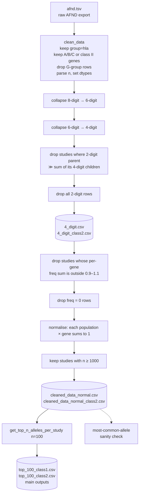

# allelefreq: Overview and Deep Dive

## Part 1: The short version

### What is this repo?

Every person has **HLA genes**. They make the "ID badge" proteins that your cells use to show fragments of their insides to the immune system. The genes vary a lot between people, and each version is called an **allele** (for example `A*02:01`). Which alleles are common depends heavily on ancestry.

The repo builds **clean, comparable lists of the most frequent HLA alleles in each well-sampled population in the world**, for both HLA classes.

**There are two main outputs:**
- **[`top_100_class1.csv`](top_100_class1.csv)**: the 100 highest-frequency class I alleles (HLA-A, -B, -C) from each of 80 large, quality-checked population studies.
- **[`top_100_class2.csv`](top_100_class2.csv)**: the same thing for class II alleles (HLA-DRB1, -DQB1, -DQA1, -DPB1, -DPA1), from 86 studies.

It is built in four steps:

1. **Downloading public data.** `afnd.tsv` is a scrape of the [Allele Frequency Net Database (AFND)](http://www.allelefrequencies.net), via [slowkow/allelefrequencies](https://github.com/slowkow/allelefrequencies). It is one large table: *allele X was found at frequency Y in population Z, which had N people*.
2. **Cleaning it.** The raw data is messy. Studies report alleles at different levels of detail, some frequencies don't add up, some studies are tiny, and some rows use a different naming system ("G-groups").
3. **Putting everything on one scale.** Every allele is converted to the same "4-digit" resolution, and frequencies are normalised so each gene in each study sums to 1.
4. **Taking the top 100 alleles per study.** Each study's alleles are sorted by frequency and the top 100 are kept.

### The main outputs

| | `top_100_class1.csv` | `top_100_class2.csv` |
|---|---|---|
| Rows (one row = one allele in one study) | 7,815 | 5,425 |
| Studies (each with sample size ≥ 1,000) | 80 | 86 |
| Genes (rows) | A 2,474 · B 3,961 · C 1,380 | DRB1 4,585 · DQB1 559 · DPB1 197 · DQA1 63 · DPA1 21 |
| Distinct alleles | 452 (of 2,662 in the cleaned data) | 556 (of 988 in the cleaned data) |
| Studies with fewer than 100 alleles (kept in full) | 4 | 70 |
| Share of each study's total allele frequency captured | 99.3% on average (minimum 95.8%) | ≈ 100% (minimum 99.6%) |
| Resolution | All 4-digit (for example `A*02:01`) | All 4-digit (for example `DRB1*07:01`) |

Both files have the columns `gene`, `allele`, `population` (the study), `alleles_over_2n` (the allele frequency, normalised within its gene), `n` (sample size) and `resolution`. The class I file also has a leftover index column called `Unnamed: 0`.

In practice, each file gives a short list per population that covers almost every allele a person in that population is likely to carry. Only the long tail of very rare alleles is left out.

The two files differ in how complete they are. Class I typing is broad: nearly every study reports A and B, and most report C. Class II typing is patchy. DRB1 is reported in 83 of the 86 studies, but DQB1 is in only 28, DPB1 in 8, and DQA1 and DPA1 in 4 each. Most class II studies report fewer than 100 alleles, so the file usually holds a study's full cleaned allele list.

### A side finding

The same cleaned data was used to ask which allele is the most common worldwide. For class I, the answer is **HLA-A\*02:01**. It is the #1 allele in about half of the studies, with an average frequency of about 18%. For class II, the most common DRB1 allele is **DRB1\*07:01**. Sections 2.5 and 2.6 have the details.

### What's in the folder

| Kind | Files | Purpose |
|---|---|---|
| Raw data | `afnd.tsv` | AFND export (all groups: HLA, KIR, MIC, cytokines) |
| Library | `utils.py` | Every cleaning and collapsing function used by the pipeline |
| Exploration | `EDA.ipynb`, `EDA2.ipynb`, `EDA3.ipynb`, `EDA-diff-resolutions.ipynb` | Step-by-step discovery of data problems and how to fix them |
| Pipeline run (class I) | `test_pipeline.ipynb` → `4_digit.csv` → `cleaned_data_normal.csv` | Final cleaned class I dataset |
| Pipeline run (class II) | `HLA-class2.ipynb` → `4_digit_class2.csv` → `cleaned_data_normal_class2.csv` | Same pipeline for DRB1/DQA1/DQB1/DPA1/DPB1 |
| **Main outputs** | `find_most_common.ipynb` → **`top_100_class1.csv`**, **`top_100_class2.csv`** | Top 100 alleles per study, for class I and class II, plus the most-common-allele analysis |
| Side task | `bingsong_hla_task.ipynb` → `bingsong_output/*.csv` | Per-population class I frequency files for 21 US NMDP populations, requested by a collaborator (Bing Song) |
| Unrelated side task | `task3.ipynb`, `task3-pytest-*.py`, `uniprotkb_human_ref_proteome_dict.pkl` | Peptide k-mer matching against the human proteome (string-matching exercise) |
| Other | `hla_embeddings_all.pkl`, `top_100.csv`, `venvName/` | Allele embedding lookup for the side task, an older top-100 export, and the Python virtualenv |

---

## Part 2: Deep dive

### 2.1 Background you need

**HLA nomenclature.** An allele name looks like `A*02:01:01:01`:

| Field | Example | Meaning | Repo calls it |
|---|---|---|---|
| Gene (locus) | `A` | Which gene | `gene` |
| 1st field | `02` | Allele group (roughly the old serological type) | "2-digit" |
| 2nd field | `01` | Specific protein. **Different protein = different peptides presented.** | "4-digit" |
| 3rd field | `01` | Synonymous DNA change (same protein) | "6-digit" |
| 4th field | `01` | Non-coding change | "8-digit" |

**4-digit resolution is the level that matters biologically**, because it is the level that distinguishes protein sequences. So the pipeline standardises everything to 4 digits.

**Class I vs class II.**
- Class I genes are A, B and C. They are expressed on almost every cell and present peptides to CD8 T-cells.
- Class II genes are DR, DQ and DP. They are expressed on immune cells and present peptides to CD4 T-cells.

**AFND columns** (`afnd.tsv`):

| Column | Meaning |
|---|---|
| `group` | `hla`, `kir`, `mic`, or `cyt` (cytokine) |
| `gene` | Locus, such as A, B, C or DRB1 |
| `allele` | For example `A*02:01` |
| `population` | Study or population name, which also acts as the unique study ID |
| `indivs_over_n` | % of individuals carrying the allele (often missing, so dropped) |
| `alleles_over_2n` | **Allele frequency**: copies / 2N, since everyone has 2 copies. This is the main value. |
| `n` | Sample size, stored as a string with commas, such as `"3,456,066"` |

### 2.2 Problems found during exploration (the EDA notebooks)

The EDA notebooks show how the cleaning rules came about.

**`EDA.ipynb`: first look.**
- About 123k rows at the time, 111k of them HLA and 69k of them class I (A/B/C).
- Everything was stored as strings. Converting to float failed on values like `'0.0100(*)'`.
- The `(*)` marker flags **G-group** entries (for example population names ending in `(G)`, such as `Saudi Arabia pop 6 (G)`). A G-group is a different grouping system: alleles with identical peptide-binding regions are lumped together. These rows can't be mixed with ordinary 4-digit rows, so **all G-group rows are removed**, which was 495 rows at the time.
- `indivs_over_n` is mostly null and is dropped.

**`EDA2.ipynb`: study quality.**
- 548 class I populations, ranging from 1 to 2802 rows each. Some "studies" report a single allele. For example, `England Newcastle` has only `B*67:01 = 0.0`.
- The first filter idea (`filter_data` in utils) required ≥ 50 alleles reported and n > 100, leaving 235 studies. **This filter was later replaced** by the stricter pipeline below.

**`EDA3.ipynb`: first answer.**
- Taking the top allele from each of the 50 largest studies already gave `A*02:01` as the clear winner (19 of 50). The data then got a more careful cleaning pass to make sure this held up.

**`EDA-diff-resolutions.ipynb`: the resolution problem.** This is the key insight. After the dataset was refreshed (about 152k rows), class I contained:

| Resolution | Rows |
|---|---|
| 4-digit | 68,780 |
| 2-digit | 22,010 |
| 6-digit | 5,688 |
| 8-digit | 482 |

The same allele can therefore appear several times in one study at different levels of detail. For example, a study might list `A*02` (2-digit), `A*02:01` (4-digit) *and* `A*02:01:01` (6-digit). Summing them naively double-counts. This notebook prototyped the collapse functions that became the core of `utils.py`.

### 2.3 The final pipeline



It is run in `test_pipeline.ipynb` (class I) and `HLA-class2.ipynb` (class II). All functions are in `utils.py`.

#### Stage A: `clean_data()` (`utils.py`)
1. Keep `group == "hla"`.
2. If `class1_only`, keep genes A, B and C. For class II, run with `class1_only=False` and then keep `DRB1, DQB1, DQA1, DPB1, DPA1`.
3. Flag G-group rows (any `*` in `alleles_over_2n`) and drop them.
4. Drop `group` and `indivs_over_n`. Strip commas from `n` and cast types (`alleles_over_2n` → float, `n` → Int64).

#### Stage B: `collapse_to_4digit()` (`utils.py`)
The work happens **per study (population)**:

1. **8-digit → 6-digit** (`collapse_8digit_to_6digit`). Group 8-digit alleles by their 6-digit parent, for example `A*01:01:01:01` → `A*01:01:01`.
   - If the parent row already exists, its frequency becomes **`max(parent_freq, sum(children))`**.
   - If the parent row does not exist, a new one is created with frequency `sum(children)`.
   - All 8-digit rows are then dropped.
2. **6-digit → 4-digit** (`collapse_6digit_to_4digit`). This follows the same logic one level up.

   *Why `max`?* If a study reports both `A*02:01 = 0.25` and its children `A*02:01:01 = 0.20` and `A*02:01:02 = 0.03`, the children are a sub-breakdown of the parent. They are not extra copies. Taking the max avoids double-counting. It also covers the case where the children are more complete than the parent.
3. **Check 2-digit consistency** (`find_2digit_larger_than_children`, `remove_inconsistent_2digit_studies`). Suppose a study says `A*02 = 0.30` but its 4-digit children `A*02:xx` only add up to 0.20. Then about 0.10 of the frequency can't be placed at 4-digit resolution. Differences are summed per study, and **any study whose total unexplained 2-digit frequency exceeds 0.005 is removed**. The 0.001 per-allele tolerance absorbs rounding.
4. **Drop all 2-digit rows.** After step 3, whatever remains is either explained by the 4-digit children or is negligible.

The result is cached to `4_digit.csv` (class I: 69,411 rows, 525 studies).

#### Stage C: `clean_and_normalize()` (`utils.py`)
Parameters used: `freq_sum_threshold=0.1`, `min_sample_size=1000`, `normalize=True`, `cleaning_method='population'`.

1. **Frequency-sum check.** For each (population, gene), frequencies should sum to about 1. If *any* gene in a study falls outside [0.9, 1.1], the **whole study** is removed. The reasoning is that a broken gene suggests the whole study is unreliable. For class I, 176 studies were removed (525 → 349).
2. **Drop zero-frequency rows.** These are "tested but not found" rows, 23,478 of them. They carry no information for ranking. Dropping them also means a later mean is taken only over studies that actually observed the allele (see caveats).
3. **Normalise.** Divide each frequency by its (population, gene) sum so that every gene in every study sums to exactly 1.0. This makes studies comparable.
4. **Sample size ≥ 1000.** Small studies give noisy frequencies. This cut takes class I from 349 to **81 studies**. The threshold was raised from 100 to 1000 in commit `88ab2a8`.

**Class I output:** `cleaned_data_normal.csv`, with 19,117 rows and 81 studies. It passes the checks in `test_pipeline.ipynb`: every row is 4-digit, every (pop, gene) sums to 1.0 within 1e-9, and every n is ≥ 1000.

Gene coverage in those 81 studies:

| Gene | Studies |
|---|---|
| A | 79 |
| B | 80 |
| C | 58 |

22 studies typed only A and B, and 2 typed a single gene.

#### Funnel summary

| Stage | Class I studies | Class II studies |
|---|---|---|
| Entering collapse | 832 (raw, pre-clean) → 525 after collapse | 1077 → 747 after collapse |
| After freq-sum check | 349 | 538 |
| After n ≥ 1000 | **81** | **86** |

### 2.4 The main outputs: `top_100_class1.csv` and `top_100_class2.csv`

#### How they are built
Both files are produced in `find_most_common.ipynb` by the same function, `get_top_n_alleles_per_study(df, n=100)`. It runs on `cleaned_data_normal.csv` for class I and on `cleaned_data_normal_class2.csv` for class II:

1. For each study (`population`), take all of its alleles.
2. Sort them by `alleles_over_2n`, from highest to lowest.
3. Keep the first 100. If a study has fewer than 100 alleles, keep all of them.
4. Concatenate the studies and save the result with `to_csv(..., index=False)`, as `top_100_class1.csv` or `top_100_class2.csv`.

In both files, every row has already been through the full pipeline in 2.3. It is 4-digit, has no zero frequencies and no G-groups, comes from a study with n ≥ 1000, and its frequency is normalised so each gene in each study sums to 1.

#### Schema

| Column | Type | Meaning |
|---|---|---|
| `Unnamed: 0` | int | **Class I file only.** Row index carried over from the cleaned data. It has no meaning and can be ignored. |
| `gene` | str | Class I: `A`, `B` or `C`. Class II: `DRB1`, `DQB1`, `DQA1`, `DPB1` or `DPA1`. |
| `allele` | str | 4-digit allele name, for example `A*02:01` or `DRB1*07:01` |
| `population` | str | Study or population name |
| `alleles_over_2n` | float | Allele frequency, **normalised within (population, gene)** |
| `n` | int | Study sample size (number of people) |
| `resolution` | str | Always `4-digit` |

Rows are grouped by study and sorted by descending frequency within each study.

#### What is in `top_100_class1.csv`

- **80 studies and 7,815 rows.** 76 studies contribute a full 100 alleles. Four have fewer:

| Study | Alleles |
|---|---|
| China South Han pop 2 | 41 |
| France French Bone Marrow Donor Registry | 48 |
| USA European American pop 2 | 48 |
| Japan pop 3 | 78 |

- **Gene mix.**

| Gene | Rows | Why |
|---|---|---|
| B | 3,961 | HLA-B is the most polymorphic class I gene |
| A | 2,474 | |
| C | 1,380 | Only about 58 of the studies typed HLA-C at all |

- **Coverage.** Within a study, the top 100 alleles account for 99.3% of the summed frequency on average. The median is 99.5% and the worst study is 95.8%. Per (study, gene), the lowest is 92.9%. The rarest allele kept in a typical study has a frequency of about 0.08%. The cutoff therefore removes only the very rare tail.
- **452 distinct alleles** appear across all studies. No single allele is in every study's top 100. The most widespread are B\*51:01, B\*35:01, B\*40:01, B\*07:02, B\*37:01, B\*13:02 and B\*15:01, which each appear in 79 of 80 studies.
- The largest studies are Germany DKMS (3.46M people) and the USA NMDP registries (European Caucasian 1.24M, African American 417k, Mexican/Chicano 261k and others). The smallest have about 1,000 people.

#### What is in `top_100_class2.csv`

- **86 studies and 5,425 rows.** This matches `cleaned_data_normal_class2.csv` exactly, so no study is missing.
- **Most studies are below the 100 cap.** 70 of the 86 studies have fewer than 100 alleles, and the median study has 54. For those studies the file is the complete cleaned allele list. Coverage of each study's total frequency is therefore essentially 100%, with a minimum of 99.6%.
- **Gene mix.**

| Gene | Rows | Studies that typed it |
|---|---|---|
| DRB1 | 4,585 | 83 |
| DQB1 | 559 | 28 |
| DPB1 | 197 | 8 |
| DQA1 | 63 | 4 |
| DPA1 | 21 | 4 |

- **Most studies typed only one class II gene.** 59 studies report one gene (almost always DRB1), 20 report two, and only 7 report three or more. Only 3 studies cover all five genes.
- **556 distinct alleles** appear across all studies. The most widespread are DRB1\*07:01, DRB1\*04:04, DRB1\*04:03, DRB1\*04:01 and DRB1\*03:01, each in 83 of 86 studies, which is every study that typed DRB1.
- The largest studies are the same registries as in class I: Germany DKMS (3.46M), USA NMDP European Caucasian (1.24M), African American (417k), Mexican/Chicano (261k) and South Asian Indian (185k).
- **What this means in practice.** The file is a strong reference for DRB1 worldwide. It is a reasonable one for DQB1. For DPB1, DQA1 and DPA1 it covers only a handful of populations and should not be read as a worldwide picture.

#### Design choices to know about (both files)

1. **The top 100 is taken across all genes of a study combined, not per gene.** Frequencies are normalised per gene, so each gene contributes a total of 1.0 per study, and the 100 slots go to whichever alleles are most frequent regardless of gene. In class I, B has the most alleles, so it gets the most slots. In class II this rarely matters, because most studies have fewer than 100 alleles in total. If you need "top N per gene", group by `gene` as well as `population`.
2. **Frequencies are normalised and zeros removed.** They are not the raw AFND numbers. Within a (population, gene), the frequencies in the file sum to slightly less than 1, because the tail beyond the top 100 is cut.
3. **Studies are not equally sized or equally spread geographically.** This applies to both files, which share their largest studies. Many are European sub-populations (Germany DKMS minorities) or US NMDP groups. Use `n` if you want to weight by sample size.
4. **One eligible class I study is missing.** The current `cleaned_data_normal.csv` has 81 studies, but `top_100_class1.csv` has 80. `Ireland Northern` (n = exactly 1000, 98 alleles) is absent. This suggests the top-100 file was generated from an earlier version of the cleaned data, probably one that used a strict `n > 1000` cut. Rerunning `find_most_common.ipynb` would add it.

### 2.5 Supporting analysis: the most common allele in the world

This was the question that motivated the cleaning pipeline. The two top-100 files became the main deliverables, but this analysis is still a useful sanity check that the cleaned data behaves sensibly.

All ranking is in `find_most_common.ipynb` and runs on `cleaned_data_normal.csv`. Three independent methods were used.

#### Method 1: "Winner per study" vote
`get_top_alleles_from_largest_studies(df, top_n=100)` takes the largest studies by `n` and, for each one, picks the single allele with the highest frequency (`idxmax`). It then counts how often each allele wins.

With `top_n=100` and only 81 studies, this effectively covers **every study**. Output recorded in the notebook, from an 80-study run:

| Allele | # studies where it is #1 |
|---|---|
| **A\*02:01** | **39** |
| A\*24:02 | 11 |
| A\*11:01 | 10 |
| A\*01:01 | 6 |
| C\*04:01 | 5 |
| others | 1 each |

The largest studies agree:

| Study | n | Top allele |
|---|---|---|
| Germany DKMS – German donors | 3,456,066 | A\*02:01 (28.5%) |
| USA NMDP European Caucasian | 1,242,890 | A\*02:01 (27.6%) |
| USA NMDP African American pop 2 | 416,581 | C\*04:01 (20.4%) |
| USA NMDP Mexican or Chicano | 261,235 | A\*02:01 (22.3%) |
| USA NMDP South Asian Indian | 185,391 | A\*01:01 (15.5%) |

The losers are also informative. **A\*24:02 and A\*11:01 win in East and Southeast Asian studies**, for example China Hubei Han, where A\*11:01 is 26%. **C\*04:01 wins in African-ancestry populations.** So A\*02:01 is the global leader, but not the leader everywhere.

#### Method 2: Average frequency across studies
Group by allele and take the mean of the normalised frequency over every study that reports it:

| Allele | Avg frequency | # studies |
|---|---|---|
| **A\*02:01** | **0.179** | 78 |
| C\*07:02 | 0.125 | 57 |
| C\*04:01 | 0.121 | 57 |
| A\*24:02 | 0.118 | 78 |
| C\*07:01 | 0.102 | 56 |
| A\*01:01 | 0.096 | 78 |
| A\*11:01 | 0.086 | 78 |

A\*02:01 leads by a wide margin: about 5.5 points over #2.

#### Method 3 (robustness check, recomputed for this write-up): sample-size weighted
Weight each study's frequency by its `n`. This pools all genotyped people into one frequency per gene. A\*02:01 comes out at **about 24.3%**, still #1. The next alleles are C\*07:01 (13.6%), A\*01:01 (13.3%) and C\*07:02 (13.3%). This view is dominated by DKMS and NMDP European, so it is skewed towards Europeans. That is why the unweighted methods above are the main result.

#### Why comparing alleles from different genes is fair
Frequencies are normalised **per gene**, so an A allele at 0.18 and a C allele at 0.12 are both "fraction of chromosomes carrying that version of *its* gene". The question "which single allele is carried by the most chromosomes?" therefore makes sense across loci.

#### Verification rerun (for this write-up)
Rerunning the ranking on the current `cleaned_data_normal.csv`, which has 81 studies (one more than the saved notebook output), gives the same conclusion:
- A\*02:01 is #1 in 40 of 81 studies overall.
- Per gene, A\*02:01 is #1 in 46 of 79 A-typed studies.
- The top B allele is B\*07:02 (#1 in 21 of 80 studies).
- The top C allele is C\*07:01 (#1 in 18 of 58 studies).
- A\*02:01 ranks in the top 3 of its gene in 63 of 79 studies. Its frequency ranges from 1.3% to 42.6% (median 18.7%).

### 2.6 Class II (`HLA-class2.ipynb`)

- AFND has only five class II loci: **DRB1, DQB1, DQA1, DPB1, DPA1**. DRA, DRB3/4/5, DM and DO are absent.
- **Bug fixed in the process.** The allele regex in `extract_allele_parts` was `([A-Z]+)\*...`, which fails on loci that contain digits, such as `DRB1`. It was changed to `([A-Z][A-Z0-9]*)\*...`. Without this fix, the class II collapse would silently do nothing.
- The same pipeline was run: 8→6 collapse (77 parents created, 13 updated) and 6→4 collapse (3,503 created, 235 updated). Then 109 studies were removed for 2-digit inconsistency, 209 for bad frequency sums, and the rest were cut by n ≥ 1000. The result is **86 studies**, with 6,656 rows in `cleaned_data_normal_class2.csv`.
- Coverage is very uneven:

| Gene | Studies | Distinct alleles |
|---|---|---|
| DRB1 | 83 | 552 |
| DQB1 | 28 | 203 |
| DPB1 | 8 | 204 |
| DQA1 | 4 | 18 |
| DPA1 | 4 | 11 |

- Top allele per gene by mean frequency:

| Gene | Top allele | Mean frequency | How reliable? |
|---|---|---|---|
| DRB1 | **DRB1\*07:01** | 10.8% | Solid. It is also #1 in 26 of 83 studies and #1 when weighted by sample size. |
| DQB1 | DQB1\*03:01 | 22.4% | Reasonable. The #2 by mean, DQB1\*03:22, comes from **one** study (Pima). |
| DPB1 | DPB1\*04:01 | 24.3% | Reasonable (8 studies). It is 42% when weighted by sample size. |
| DQA1 | DQA1\*05:03 | 21.1% | **Unreliable.** Only 4 studies, and the value is driven by one (Pima, 80%). |
| DPA1 | DPA1\*01:03 | 49.2% | Only 4 studies. |

### 2.7 Side task: Bing Song's NMDP files (`bingsong_hla_task.ipynb`)
A collaborator needed class I frequencies for 21 US NMDP populations in a specific format. The rules differ from the main pipeline:
- Sample size doesn't matter, and frequencies are **not** normalised.
- **Collapse rule is different.** If a 4-digit parent exists, its frequency is kept and the children are ignored. Only if there is no parent are the children summed. This is "parent wins", not `max`. It was implemented locally as `collapse_pass()` because the `utils` version crashed on this subset with an `IndexError` caused by index misalignment.
- 2-digit rows are dropped.
- The asterisk is stripped (`A*02:01` → `A02:01`), and only alleles present in `hla_embeddings_all.pkl` are kept. That file contains 8,722 alleles, each with a 32-dimensional embedding. 73 rows were dropped, all of them null or questionable alleles with an `N`/`Q` suffix.
- The output is one CSV per population in `bingsong_output/`. `nmdp_population_sizes.csv` holds estimated US population sizes per group, which is useful for population-weighted averaging later.

### 2.8 Caveats and things to keep in mind

1. **Studies are not a random sample of the world.** Of the 81 surviving class I studies, many are European (DKMS has many sub-populations) or US NMDP. Sub-Saharan Africa, Central Asia and Oceania are thin. An unweighted mean over *studies* is not the same as a mean over *people on Earth*. A\*02:01 wins in all three views, but the exact percentages depend on the method.
2. **The mean only covers studies that report the allele**, because zeros were dropped. This inflates alleles that appear in only a few studies. It explains DQB1\*03:22 and DQA1\*05:03 in class II. This does not affect `top_100_class1.csv`, which ranks alleles within each study. For class I it doesn't matter much, since A\*02:01 appears in 78–79 of 79 A-typed studies.
3. **Collapse uses `max(parent, sum(children))`**, which is a judgement call. The side task used "parent wins" instead. Both are reasonable, and neither affects the headline result.
4. **Stale outputs.** `top_100_class1.csv` is missing `Ireland Northern` (see 2.4). `afnd.tsv` was refreshed during the project, growing from 123k to 152k to 164k rows. `4_digit.csv` is cached and reloaded if present, so it may predate the latest TSV. The notebook output in `find_most_common.ipynb` shows 80 studies, while the current CSV has 81. Delete `4_digit*.csv` to force a full rebuild.
5. **`filter_data()` in utils is legacy.** It was used in EDA2/EDA3 but not in the final pipeline.
6. `task3-pytest-hashtable.py` is currently an exact copy of `task3-pytest-bruteforce.py`. The hash-table version hasn't been written yet.

### 2.9 Reproducing

```bash
source venvName/bin/activate
```

Then:
1. Open `test_pipeline.ipynb` and run all cells. This writes `cleaned_data_normal.csv`.
2. Open `HLA-class2.ipynb` and run all cells. This writes `cleaned_data_normal_class2.csv`.
3. Open `find_most_common.ipynb` and run all cells. This writes the two main outputs, **`top_100_class1.csv`** and **`top_100_class2.csv`**, and shows the most-common-allele rankings.
